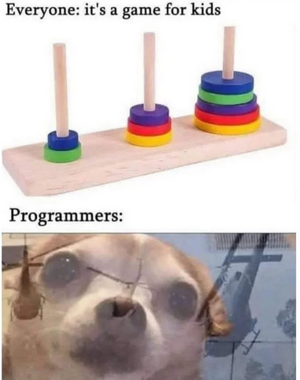

# 🗼 Tower of Hanoi Visualizer (PyQt + Matplotlib)

An interactive and visually enhanced **Tower of Hanoi simulator** built using **PyQt6** and **Matplotlib**.

This project goes beyond simple visualization — it allows users to **both observe and actively solve** the Tower of Hanoi problem through a combination of **automated animation** and an **interactive manual mode**.

---

## ✨ Features

### 🎯 Dynamic Visualization
- Displays Tower of Hanoi steps with smooth animations.
- Rounded disks with shadows for a modern look.

### 🖱️ Manual Mode (Interactive Gameplay) ⭐
- Solve the puzzle yourself by clicking on pegs.
- First click → select disk, second click → place disk.
- Built-in validation prevents illegal moves.
- Tracks your moves in real-time and updates the graph.
- Turns the project into a **learning tool + mini puzzle game**.

### 📊 Live Graph Mode
- Real-time graph of moves vs steps.
- Updates dynamically during both **auto** and **manual** play.
- Highlights the current step.

### ▶️ Auto Simulation
- Automatically solves the puzzle using recursion.
- Step-by-step animation of optimal solution.

### 🎨 Modern Dark UI
- Fully consistent dark theme.
- Neon/cyan accents for readability and aesthetics.

### ⚙️ Adjustable Disk Count
- Choose number of disks (1–10).
- Smart scaling prevents disk overflow.

---

## 🧠 Algorithm Used

The automatic solution uses the classic **recursive approach**:

- Move `n-1` disks from source → auxiliary  
- Move largest disk to destination  
- Move `n-1` disks from auxiliary → destination  

### ⏱ Time Complexity
$T(n) = 2^n - 1$


This exponential growth is also reflected in the live graph.

---

## 🖥️ Tech Stack

- **Python 3**
- **PyQt6** → GUI framework
- **Matplotlib** → Visualization & plotting

---

## 🚀 How to Run

### 1. Install dependencies

```bash
pip install pyqt6 matplotlib
```

---

## 🎮 Controls
| Button      | Function                   |
| ----------- | -------------------------- |
| Generate    | Creates a new problem      |
| Run         | Starts automatic solution  |
| Stop        | Stops animation            |
| Manual Mode | Toggle interactive solving |


---

🧩 Manual Mode Explained

Manual Mode allows users to play and solve the puzzle themselves:
1. Click on a peg to select a disk
2. Click another peg to move it
3. Invalid moves are automatically blocked

This mode helps in:

1. Understanding constraints of the problem
2. Learning recursive logic intuitively
3. Comparing your solution with the optimal one

---

📊 Graph Explanation
1. X-axis → Steps (moves performed)
2. Y-axis → Number of moves
3. Updates live during both:
4. Auto simulation
5. Manual solving

---

Inspired by the classic Tower of Hanoi problem, widely used in computer science to demonstrate recursion and algorithmic thinking.

> Bhai end me yahi bolunga ki instagram me reel dikha tha : Tower of Hanoi when childer solve it and when programmers do it , meme attached below :



> Made it this far ? Soo the code is needing some improvements will do em shortly ! 
